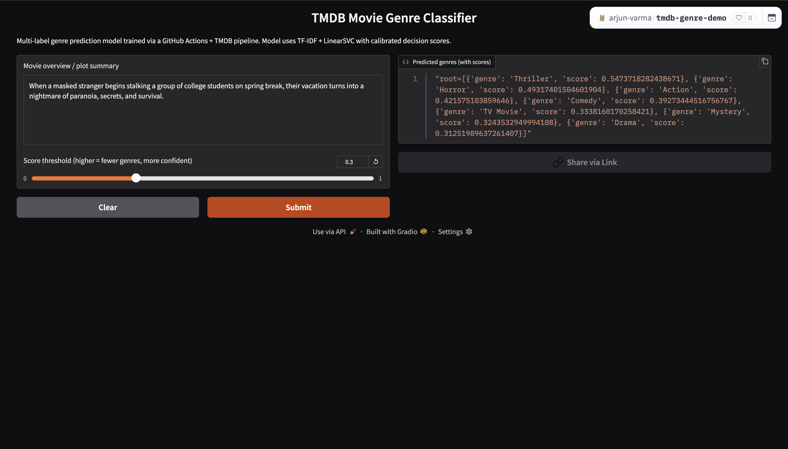
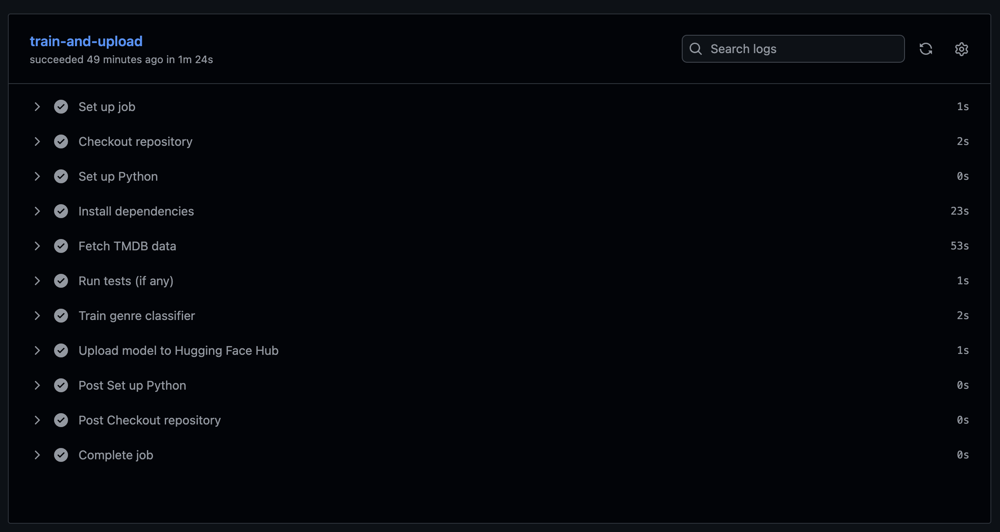

# 🎬 TMDB Movie Genre Classifier — Serverless Machine Learning Pipeline
_A fully-automated MLOps pipeline using TMDB API, GitHub Actions, Hugging Face Hub, and Linear SVC_

---

## 🚀 Summary

This project demonstrates a **production-grade Serverless ML Pipeline** built without relying on cloud-paid infrastructure.  
It automatically:

1️⃣ **Fetches real movie metadata** from the TMDB API  
2️⃣ **Cleans, balances, and prepares data for multi-label learning**  
3️⃣ **Trains a TF‑IDF + Linear SVC Multi‑Label Classifier**  
4️⃣ **Evaluates, stores artifacts, and tracks metrics**  
5️⃣ **Deploys a live demo to Hugging Face Spaces**  
6️⃣ **Runs nightly via GitHub Actions** to keep the model fresh  

Multi-label genre classification is a real problem because movies are rarely just one thing.  
Is *Interstellar* Sci‑Fi? Drama? Adventure? Philosophy? — Answer: **Yes, simultaneously.**

This project showcases:
- ML Engineering
- MLOps
- Testing & Automation
- Deployment & Documentation
- Real‑world decision‑making and trade-offs

---

## 🧱 Architecture — Serverless ML Pipeline


➡ No AWS SageMaker  
➡ No Azure ML Studio  
➡ No GCP Vertex AI  
➡ **Fully free & serverless**

---

## 🎯 Why Multi‑Label Classification?

Traditional ML assumes one label per sample.  
But movies are complex arts — they span *Romance + Comedy*, or *Action + Sci‑Fi + Thriller*.  

Example synopsis:  
> “A scientist travels through time to save his family.”  
Likely genres:  
- **Sci‑Fi**
- **Drama**
- **Adventure**

A single‑label model fails here.  
Multi‑label classification allows the model to return **multiple correct genres**, along with prediction scores.

---

## 🤖 Model — Why TF-IDF + Linear SVC?

| Model Approach | Notes |
|----------------|-------|
| Neural Networks | Heavy, expensive, slow retraining |
| Fine‑tuned Transformers | Amazing results, not ideal for nightly pipelines |
| TF‑IDF | Proven for sparse, domain-specific text |
| LinearSVC | Strong margin learning, high recall, low latency |

➡ The combination offers:
- **Fast training**
- **Great real-world performance**
- **Zero GPU required**
- **Ideal for continuous retraining**

**Why not Logistic Regression?**  
LogReg produced **near‑zero recall**. It played “safe” and predicted **nothing** confidently.  
Linear SVC + thresholding solved the problem.

---

## 📊 Metrics Summary — Before & After

| Model | Precision_micro | Recall_micro | F1_macro | Notes |
|------|----------------|--------------|----------|------|
| Logistic Regression | 0.83 | 0.006 | ~0.03 | Predicts almost nothing |
| Linear SVC + threshold 0.25 | 0.16 | **0.99** | **0.27** | Predicts intelligently |

Key Insight:
- Perfect recall ≠ good model → Thresholding becomes your product decision knob
- This project exposes you to that real trade-off

---

## 🧪 Testing

Test coverage includes:
- Mocked TMDB API fetch tests
- Unit tests for data transformation
- Model training sanity tests
- End-to-end test verifying artifacts & metrics

Tools:
- `pytest`
- `monkeypatch`
- `tmp_path` for local isolated builds

---

## 🖥 Live Demo & Screenshots

| Component | Link |
|----------|------|
| 🔗 **Live Hugging Face Space** | 👉 [link](https://arjun-varma-tmdb-genre-demo.hf.space/?__theme=system&deep_link=uuDed8RzLJI) |
| 🧠 **Model Card / Artifacts** | 👉 [link](https://huggingface.co/arjun-varma/tmdb-genre-classifier) |

- UI prediction screenshot  


- GitHub Actions run log


Latest model metrics
```
{
    'precision_micro': 0.1532142123639351, 
    'recall_micro': 0.9880794701986755, 
    'f1_micro': 0.2652916073968706, 
    'precision_macro': 0.15242664363769637, 
    'recall_macro': 0.9876794004044939, 
    'f1_macro': 0.25712052914261946, 
    'n_train': 1067, 
    'n_test': 267, 
    'threshold': 0.25, 
    'per_genre_f1': {
        'Action': 0.37770897832817335, 
        'Adventure': 0.29431438127090304, 
        'Animation': 0.18181818181818182, 
        'Comedy': 0.4025157232704403, 
        'Crime': 0.2206896551724138, 
        'Documentary': 0.17355371900826447, 
        'Drama': 0.5277777777777778, 
        'Family': 0.25675675675675674, 
        'Fantasy': 0.20422535211267606, 
        'History': 0.1543859649122807, 
        'Horror': 0.23728813559322035, 
        'Music': 0.1423487544483986, 
        'Mystery': 0.20209059233449478, 
        'Romance': 0.26440677966101694, 
        'Science Fiction': 0.22602739726027396, 
        'TV Movie': 0.24742268041237114, 
        'Thriller': 0.45161290322580644, 
        'War': 0.12454212454212454, 
        'Western': 0.1958041958041958
    }
}
```

---

## ⚡ Lessons Learned

| Lesson | Value |
|--------|-------|
| APIs contain bias | Popular movies ≠ balanced dataset |
| Rare genres create classification challenges | Threshold & oversampling help |
| Multi-label problem design matters | Problem > Model |
| Simpler models still win in production | TF-IDF + SVC → fast + reliable |
| MLOps separates beginners from engineers | Automation is the differentiator |

---

## 💡 Possible Future Enhancements

| Feature | Value |
|--------|------|
| Add FastAPI inference API | Deployable microservice |
| Add threshold selection UI | Explainable ML |
| Add confusion matrix per label | Deeper debugging |
| Article + LinkedIn post | Recruiter visibility |
| Cost Optimization write-up | MLOps savy |
| Use actual cloud platforms (AWS, GCP, Azure) | Industry relevant Serverless design |

---

## 📄 License
MIT — This project is open and free to use.

---

## 🧑‍💻 Author
**Arjun Varma**  
Machine Learning Engineer & Systems Builder

---
